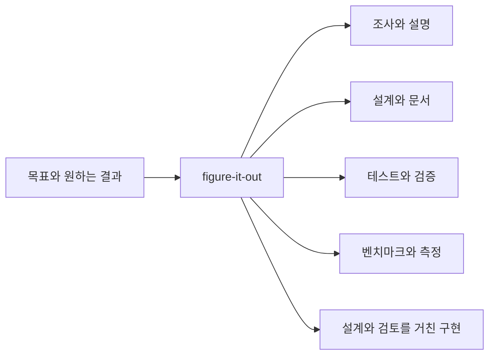

# Emeth

Emeth는 코딩 에이전트가 요청받은 작업 범위를 끝까지 지키고, 직접 확인한 결과를 바탕으로 완료 여부를 보고하도록 돕는 플러그인입니다. Codex와 Claude Code를 지원합니다.

작업이 길어지면 처음 요청의 세부 조건을 빠뜨리거나, 확인하지 않은 부분까지 끝났다고 보고하기 쉽습니다. 대화 중 발견한 버그나 후속 작업도 다음 작업으로 이어지지 않고 잊히곤 합니다. Emeth는 대화에 적용할 공통 기준과 작업별 스킬, 프로젝트에 남는 기록으로 이런 누락을 줄입니다.

## ✨ 주요 기능

- **대화와 결과물 품질 관리**: 요청한 범위와 수정 권한을 지키고, 확인한 근거를 바탕으로 결과를 보고합니다.
- **요청에 맞는 작업 흐름**: 조사, 설계, 테스트, 구현과 벤치마크에 필요한 절차를 선택하고 완료까지 조율합니다.
- **코드 이해와 후보 비교**: 코드 구조와 실행 흐름을 관계도로 보여주고, 동작과 설계 이유를 설명하며, 독립 후보를 비교해 결과를 개선합니다.
- **리팩터링과 코드 이식 검증**: 실제 구조가 바뀌었는지, 원본 동작이 보존됐는지 확인합니다.
- **프로젝트 기록 관리**: 이슈, 기획서, 구현 명세를 파일로 남겨 다음 작업에서 참고합니다.
- **아키텍처 관리**: 프로젝트 구조와 설계 결정, 운영 제약을 기록·갱신하고 설계·구현·검토에 활용합니다.
- **통합 대시보드**: 여러 프로젝트의 작업 현황과 문서를 한곳에서 확인합니다.

## 📊 벤치마크

SuperJSON의 Error 스택 직렬화 작업을 같은 요구 사항으로 실행한 결과입니다.

- **None**: 플러그인 미사용
- **Core**: 플러그인 활성화, 명시적인 스킬 호출 없음
- **Workflow**: [`/emeth-discipline:figure-it-out`](plugins/emeth-discipline/skills/figure-it-out/SKILL.md) 호출
- **Lite**: [`/emeth-discipline:figure-it-out-lite`](plugins/emeth-discipline/skills/figure-it-out-lite/SKILL.md) 호출

| 모델 | 조건 | 공식 외부 검사 | 추가 진단 | 시간 | 비교용 추정 비용 |
| --- | --- | ---: | ---: | ---: | ---: |
| 6.2 Astra Light | None | 195.3/196 | 8.7/14 | 4분 29초 | $0.658 |
| 6.2 Astra Light | Core | 194.3/196 | 9/14 | 3분 57초 | $0.737 |
| 6.2 Astra Light | Workflow | 195/196 | 10.3/14 | 5분 22초 | $2.420 |
| 6.2 Astra Light | Lite | 195/196 | 10/14 | 7분 19초 | $1.756 |
| 6.2 Sol medium | None | 195.7/196 | 10.3/14 | 7분 42초 | $0.412 |
| 6.2 Sol medium | Core | 195.3/196 | 10.7/14 | 7분 44초 | $0.396 |
| 6.2 Sol medium | Workflow | 196/196 | 11/14 | 13분 56초 | $1.918 |
| 6.2 Sol medium | Lite | 195.3/196 | 10.7/14 | 10분 54초 | $0.819 |
| 6.1 Terra medium | None | 191.7/196 | 4/14 | 2분 41초 | $0.076 |
| 6.1 Terra medium | Core | 195.7/196 | 4.3/14 | 2분 56초 | $0.095 |
| 6.1 Terra medium | Workflow | 195.7/196 | 6.3/14 | 6분 41초 | $0.383 |
| 6.1 Terra medium | Lite | 195/196 | 5/14 | 4분 39초 | $0.165 |
| Opus 5.5 medium | None | 195/196 | 6.3/14 | 5분 39초 | $1.372 |
| Opus 5.5 medium | Core | 194.3/196 | 6.7/14 | 6분 52초 | $1.684 |
| Opus 5.5 medium | Workflow | 194.7/196 | 5.7/14 | 19분 15초 | $3.761 |
| Sonnet 5.5 medium | None | 195.3/196 | 6.3/14 | 4분 0초 | $0.574 |
| Sonnet 5.5 medium | Core | 195.7/196 | 6.3/14 | 4분 38초 | $0.639 |
| Sonnet 5.5 medium | Workflow | 195.3/196 | 7.7/14 | 7분 13초 | $1.463 |

[평가 항목과 회차별 결과](docs/benchmarks/README.md) / [원본 데이터](docs/benchmarks/superjson.json)

## 📦 설치

### Codex CLI에서 설치
```bash
codex plugin marketplace add semisemil/emeth-discipline
codex plugin add emeth-discipline@emeth-discipline
```

사용자 설정 파일 `~/.codex/config.toml`에 다음 설정을 추가합니다.
Windows의 기본 경로는 `%USERPROFILE%\.codex\config.toml`입니다.

```toml
[features]
incremental_tools = true

[features.multi_agent_v2]
enabled = true
preserve_fork_prefix = true
```
설정을 저장한 뒤 Codex를 시작합니다.
```bash
codex
```

Codex가 열리면 다음 순서로 마무리합니다.

1. `/hooks`를 엽니다.
2. Emeth의 `SessionStart`, `SubagentStart`, `UserPromptSubmit` 훅을 확인하고 승인합니다.
3. 새 작업을 시작합니다.

대시보드 최초 등록에는 프로젝트 밖의 저장 폴더에 쓰기 권한이 필요합니다. [저장 위치와 권한 설정](#대시보드-저장-위치와-권한-설정)을 참고하세요.

### Claude Code에서 설치

Claude Code에서 마켓플레이스를 추가한 다음 플러그인을 설치합니다.

```text
/plugin marketplace add semisemil/emeth-discipline
/plugin install emeth-discipline@emeth-discipline
```

## 🚀 빠르게 사용하기

### 기본 지침
새 작업을 시작하면 기본 지침이 자동으로 적용됩니다.
따로 스킬을 호출할 필요는 없습니다.

### 기존 프로젝트 파악하기
`architecture-memory-init`은 기존 코드와 문서를 읽고 프로젝트 구조, 주요 결정과 운영 제약을 아키텍처 문서로 정리합니다.
기존 프로젝트의 배경을 정리하고 싶을 때 호출하세요.

```text
/emeth-discipline:architecture-memory-init
```

생성한 문서는 이후 설계와 구현에서 참고합니다.

### 코드 구조와 실행 흐름 보기

`map`은 현재 소스의 클래스와 함수가 호출, 이벤트, 구현 선택을 통해 어떻게 연결되는지 관계도로 보여줍니다.
아키텍처 문서가 연결되어 있으면 `architecture`를 붙여 기록된 시스템 전체 구조도 볼 수 있습니다.

```text
/emeth-discipline:map code 파일 저장 기능의 호출과 이벤트 흐름을 보여 줘
```

## 🧩 포함된 스킬

### 공통 규칙과 작업 관리

공통 품질 기준, 작업 검증, 이슈 기록과 대시보드를 담당합니다.

| 스킬 | 이런 때 사용합니다 | 하는 일 |
| --- | --- | --- |
| `/emeth-discipline:rules` | 기본 적용 | 명확한 표현, 요청 범위, 수정 권한, 판단 근거 확인, 요구사항 임의 누락 방지와 완료 조건 확인 |
| `/emeth-discipline:scope-integrity` | 규모가 크거나 위험하고 여러 단계로 진행되는 작업 | 요청한 목표, 필수 조건과 완료 기준을 모든 실행 경로와 단계에 적용 |
| `/emeth-discipline:slop-check` | 기존 코드에 맞춰 작성하거나 불필요한 코드를 찾을 때 | 불필요한 처리, 중복 구현과 관례 이탈을 근거로 판정하고 정리 방향 제시 |
| `/emeth-discipline:refactor-proof` | 책임, 의존 관계, 호출 구조, 상태 흐름을 바꾸는 리팩터링 | 실제 구조 변경과 기존 동작 보존 여부 검증 |
| `/emeth-discipline:verification-harness` | AI가 결과물을 스스로 검증할 환경을 만들거나, 그 환경이 있는 프로젝트에서 기능 추가·동작 변경·버그 수정을 할 때 | 사용자와 확정한 기준을 E2E 수용 테스트로 만들고, 결함을 넣어 실패하는지 확인한 뒤 기준 변경을 승인제로 관리 |
| `/emeth-discipline:exact-port` | 원본 동작을 그대로 옮겨야 하는 코드 이식 | 원본과 대상 비교, 사용자에게 승인받은 차이와 미확인 부분 기록 |
| `/emeth-discipline:issue-ledger` | 버그나 후속 작업을 프로젝트에 남길 때 | 현재 상태, 다음 조치, 완료 조건, 결정과 검증 근거 기록 |
| `/emeth-discipline:settings` | 설정을 바꾸거나 대시보드를 열 때 | 수신함·자동 기록·언어 설정과 대시보드 관리 |
| `/emeth-discipline:adaptive-reasoning` | Codex에서 작업 중 추론 강도를 조절하고 싶을 때 (Codex 전용) | 명시 호출 후 현재 모델을 유지하며 작업에 맞춰 추론 강도 조절 |

### Architecture

프로젝트 구조를 함께 설계하고, 배경과 주요 결정을 기록하거나 참고합니다.

| 스킬 | 이런 때 사용합니다 | 하는 일 |
| --- | --- | --- |
| `/emeth-discipline:architecture-coop` | 새 아키텍처를 설계하거나 기존 구조를 재설계할 때 | 추천안과 질문을 먼저 제시하고, 전체 방향을 유지하며 구조를 함께 완성 |
| `/emeth-discipline:architecture-memory-init` | 기존 프로젝트 전반을 먼저 분석하고 싶을 때 | 코드와 기존 문서를 바탕으로 구조·제약·결정 정리 |
| `/emeth-discipline:architecture-memory` | 프로젝트 배경을 참고하거나 새로 결정한 내용을 남길 때 | 관련 문서 검색, 사용자 결정과 운영 환경 기록 |
| `/emeth-discipline:architecture-memory-update` | 아키텍처 문서가 연결된 프로젝트에서 커밋한 뒤 | 문서 갱신 필요 여부 확인과 변경 내용 반영 |
| `/emeth-discipline:architecture-memory-maintain` | 문서에 여러 주제나 중복이 쌓여 필요한 내용을 찾기 어려울 때 | 의미와 근거를 보존하며 내용을 분리하거나 통합하고, 실제 검색과 부분 조회로 확인 |

### Workflow

요청한 결과에 맞는 조사, 설계, 검증과 구현 절차를 연결합니다.

| 스킬 | 이런 때 사용합니다 | 하는 일 |
| --- | --- | --- |
| `/emeth-discipline:clarify-request` | 막연한 요청을 AI에게 맡길 작업 지시서로 정리하고 싶을 때 | 대화로 무엇을 왜 하는지, 목표와 완료 기준을 구체화하고 다른 AI에게 전달할 지시서 작성 |
| `/emeth-discipline:development-design` | 개발설계문서를 작성하거나 수정할 때 | 작업에 맞는 문서 형식으로 개요와 상세 설계를 여러 파일에 연결해 작성 |
| `/emeth-discipline:tenet-me` | 설계나 구현이 요구 결과를 보장하는지 검토할 때 | 결과에서 필요한 조건과 근거를 역추적하고, 발견한 빈틈을 정방향 사례로 확인 |
| `/emeth-discipline:sharpen` | 여러 전문 분야의 판단과 검증이 필요한 작업을 맡길 때 | 작업 목표를 분명히 하고, 전문가의 데이터와 방법 및 도구를 적용해 결과를 검증 |
| `/emeth-discipline:figure-it-out` | 스킬을 직접 고르지 않고 작업을 맡길 때 | 조사, 설계, 테스트, 구현과 벤치마크에 맞는 절차를 선택하고 완료까지 조율 |
| `/emeth-discipline:figure-it-out-lite` | 같은 작업에서 위임 비용을 줄이는 실험판을 사용할 때 | Design과 리뷰를 유지하고, 필요한 작업만 위임한 뒤 간결한 결과 보고를 받아 진행 |
| `/emeth-discipline:start-implementation` | 준비된 설계를 구현할 때 | 기능 개발, 버그 수정, 리팩터링에 맞는 절차로 구현 조율과 검증 |

### 코드 이해와 후보 비교

| 스킬 | 이런 때 사용합니다 | 하는 일 |
| --- | --- | --- |
| `/emeth-discipline:code-exploration` | 코드의 동작과 설계 이유를 이해하거나 배우고 싶을 때 | 질문에 맞춰 how, why, teach 모드로 코드와 변경 이력을 조사하고 설명 |
| `/emeth-discipline:map` | 현재 코드 구조, 특정 기능의 실행 흐름이나 아키텍처 문서에 기록된 시스템 전체 구조를 보고 싶을 때 | `code`는 소스에 근거해 동작 주체와 호출, 이벤트, 구현 선택 관계를, `architecture`는 시스템 경계와 주요 구성 요소를 그래프로 표시 |
| `/emeth-discipline:work-trace` | 작업의 탐색 과정과 결론의 근거를 보고 싶을 때 | 요청한 작업에서 의미 있는 변화가 있을 때 답변 직전에 탐색 그래프 갱신 |
| `/emeth-discipline:ensemble` | 설계나 구현에 여러 후보를 비교하고 싶을 때 | 독립 후보 생성, 교차 평가, 좋은 부분의 합성, 결과 검증 |

`map`과 `work-trace`는 Graph Viewer가 연결되어 있으면 그래프 탭에 표시합니다.
연결되어 있지 않으면 답변에 Mermaid 흐름도를 표시합니다.
`work-trace`는 표시를 요청한 작업에 적용되며, 새 근거, 주요 작업이나 분기, 검증 결과 또는 결론이 그래프의 의미를 바꿀 때 갱신합니다.
실시간 갱신을 요청한 경우에도 같은 기준을 적용합니다.

## 🔁 요청에 맞는 워크플로

`figure-it-out`에 목표와 원하는 결과를 말하면 필요한 스킬과 프로젝트 도구를 선택합니다.
조사, 아키텍처 협의, Design 작성, 테스트와 벤치마크는 각각 요청한 산출물로 완료합니다.
구현을 요청하면 필요한 설계와 검토를 거쳐 구현과 검증까지 이어갑니다.
각 단계의 스킬을 따로 호출할 수도 있습니다.


```mermaid
flowchart LR
    A[목표와 원하는 결과] --> F[figure-it-out]
    F --> I[조사와 설명]
    F --> D[설계와 문서]
    F --> T[테스트와 검증]
    F --> M[벤치마크와 측정]
    F --> C[설계와 검토를 거친 구현]
```

혼합 요청은 필요한 절차를 조합합니다.
예를 들어 성능을 비교하고 개선하는 요청은 기준 측정, 원인 조사, 필요한 설계와 구현, 같은 조건의 재측정으로 이어집니다.

**Design**은 개발할 대상과 설계, 검증 기준을 담는 문서 묶음입니다.

## 전문 분야의 판단과 검증

`sharpen`을 직접 호출하면 달성할 목표를 분명히 하고, 전문가가 실제로 쓰는 데이터, 방법과 도구를 적용합니다.
프로젝트가 하는 일에 맞춰 여러 전문 분야에 서로 다른 질문을 맡기고, 외부 도구로 결과를 검증합니다.

```text
/emeth-discipline:sharpen 이 서비스의 가입 이탈 원인을 조사하고 개선안을 제안해 줘
```

## 🗂️ 이슈 기록

`issue-ledger`는 버그, 일반 작업, 기능, 조사, 문서화, 유지보수 항목을 프로젝트에 저장합니다.

**이슈 자동 등록과 관련 Design 자동 갱신은 기본 비활성화**입니다.
직접 요청한 기록 작업과 워크플로의 필수 문서 작업은 설정과 관계없이 수행합니다.

전역 자동 기록은 설정 명령으로 켜고 끕니다.

```text
/emeth-discipline:settings work-records on
/emeth-discipline:settings work-records off
/emeth-discipline:settings status
```

`on`은 켜기, `off`는 끄기, `status`는 모든 설정 확인입니다.
설정은 다음 위치의 `settings.json`에 저장합니다.

| 환경 | 전역 설정 위치 |
| --- | --- |
| Windows | `%APPDATA%\emeth\settings.json` |
| Linux, macOS | `$XDG_CONFIG_HOME/emeth/settings.json`, 미설정 시 `~/.config/emeth/settings.json` |

```json
{"schema_version": 1, "work_records": true, "inbox": false, "language": "ko"}
```

이전 버전이 만든 `work-records.json`과 `inbox.enabled`는 `settings.json`에 해당 설정이 없을 때 읽습니다.
프로젝트의 `.emeth/work-records.json`은 `{"schema_version": 1, "enabled": true}` 형식을 쓰며 **전역 설정보다 우선**합니다.
설정 안내는 새 대화나 컨텍스트 재구성 시 반영됩니다.

```text
/emeth-discipline:issue-ledger
설정 파일 호환성 문제를 이슈로 등록해줘.
```

```text
/emeth-discipline:issue-ledger
PL-0012의 진행 상황과 확인 근거를 갱신해줘.
```

처음 이슈를 등록하면 다음 구조가 만들어집니다.

```text
.emeth/
  STATE.md
  issues/
    PL-0001.json
```

이슈마다 JSON 파일 하나에 현재 상태, 다음 조치, 완료 조건, 결정과 검증 근거를 저장합니다. 상세 로그나 실험 보고서는 별도 파일로 연결합니다.
Design의 개요는 기본적으로 `.emeth/designs/<DESIGN-ID>-<이름>/DESIGN.md`에 저장하고, 주제별 상세 설계는 같은 디렉터리의 별도 Markdown 파일로 연결합니다.
이슈를 지정하면 관련 작업을 연결할 수 있습니다.

### 문서 저장 경로

기본 저장 위치는 다음과 같습니다.

| 문서 | 위치 |
| --- | --- |
| 아키텍처 | `docs/architecture/` 또는 이미 연결한 폴더 |
| 개발 설계 | `.emeth/designs/` |
| 이슈 | `.emeth/issues/` |

아키텍처와 개발 설계를 다른 폴더에 저장하려면 프로젝트의 `.emeth/documents.json`에 경로를 지정하세요.

```json
{
  "schema_version": 1,
  "root": "D:/Obsidian/projects/my-project"
}
```

이 예시는 지정한 폴더 아래의 architecture/와 designs/에 각각 저장합니다.
각 폴더를 따로 정하려면 `root` 대신 `architecture`와 `designs`에 경로를 지정하세요.
상대 경로는 프로젝트 폴더를 기준으로 합니다.
기존 문서는 직접 옮긴 뒤 설정을 바꾸세요.

## 🏛️ 아키텍처 메모리

아키텍처 메모리는 프로젝트 구조, 운영 환경, 제약, 주요 결정과 그 이유를 Markdown 문서로 관리합니다.
첫 Design을 저장하면 관련 맥락부터 기록합니다.
기존 프로젝트 전반을 정리하려면 [초기화 스킬](#기존-프로젝트-파악하기)을 호출하세요.

기본 위치는 `docs/architecture/`입니다. 코드·기존 문서·현재 대화를 바탕으로 프로젝트 구조와 설계 결정, 운영 제약을 정리합니다.

첫 Design 저장 또는 초기화에 성공하면 `.emeth/architecture.json`에 문서 위치를 저장합니다. 이후 이 연결이 있는 프로젝트에서만 훅을 통해 메모리 스킬을 안내합니다. 개발 판단에 필요한 부분을 검색해 읽고, 앞으로도 참고할 결정이나 운영 정보가 생기면 관련 문서에 반영합니다. 일반 프로젝트 대화의 중요한 맥락도 기록합니다. 출처·범위·확정 여부를 보존하고, 읽기 전용 또는 기록 금지 요청에서는 문서를 수정하지 않습니다. 프로젝트 설정의 `enabled: false`나 비활성 Memory도 유지합니다.

커밋한 뒤에는 에이전트가 `architecture-memory-update`로 아키텍처 문서 갱신이 필요한지 확인합니다.
문서에 영향을 주는 변경이 있으면 해당 내용을 반영합니다.

Design의 상태만 바꿀 때는 Memory 연결 상태를 조회하며 초기화를 재시도하지 않습니다. 초기화 실패를 해결한 뒤 Design을 다시 저장하거나 Memory 초기화를 명시적으로 실행하면 연결을 재시도할 수 있습니다.

훅을 지원하지 않는 환경에서는 `architecture-memory`를 직접 호출할 수 있습니다.

## 🖥️ 통합 대시보드

여러 프로젝트의 작업 현황, 검토할 결과와 프로젝트 문서를 한곳에서 확인합니다.

에이전트에게 “대시보드 열어 줘”라고 요청하거나 다음 명령을 실행하세요.

```text
/emeth-discipline:settings dashboard open
```

작업 수신함 기록은 기본적으로 꺼져 있습니다. `/emeth-discipline:settings inbox on`으로 켤 수 있습니다.
프로젝트가 목록에 없으면 해당 프로젝트에서 `/emeth-discipline:settings dashboard add`를 실행하세요.

### 대시보드 저장 위치와 권한 설정

대시보드 데이터는 프로젝트 밖의 사용자별 공용 폴더에 저장합니다.
프로젝트 등록 중 권한 오류가 나면 [상세 설정 절차](plugins/emeth-discipline/skills/settings/references/sandbox-setup.md)를 참고하세요.

## ✅ 개발 검증

저장소 루트에서 전체 테스트를 실행합니다. 별도 패키지 설치는 필요하지 않습니다.

```bash
npm test
```

Codex의 실제 로더·훅·요청 전달·대시보드 경로를 검증하는 명령은 [호스트 검증](docs/host-validation.md)을 참고하세요.

## 라이선스

[MIT](LICENSE)
