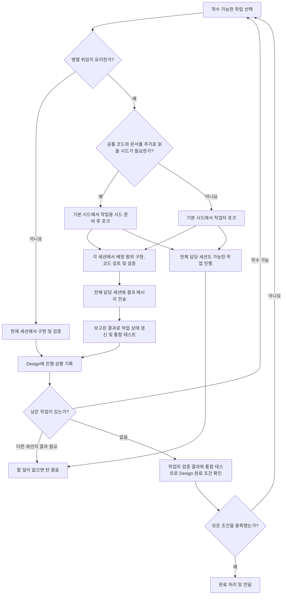

# 구현

기본 시드에서 물려받은 Design을 사용하고, 이후 변경된 리비전의 차이만 확인한다.

이 문서를 실행하는 현재 세션이 전체 담당 세션이다. 기본 시드는 Design을 읽고 멈춘 별도 세션이며, 작업자는 기본 시드 또는 작업용 시드를 `fork_thread`로 포크한 별도의 작업 세션이다.

병렬 위임을 선택한 경우, 확정된 인터페이스와 겹치지 않는 수정 범위를 기준으로 작업을 배정한다. Design, 담당 범위, 완료 기준, 작업할 코드 위치와 결과를 받을 전체 담당 세션의 ID를 전달한다. 다른 호스트라면 호스트 ID도 전달한다. 생성한 작업 세션의 ID와 배정 범위를 Design에 기록한다.

작업용 시드는 기본 시드를 포크하여 여러 작업자가 공유할 코드와 구현 문서를 추가로 읽고 멈춘 세션이다. 상당한 분량의 안정적인 맥락을 공유할 때만 준비한다. 준비가 끝나면 `send_message_to_thread`로 전체 담당 세션에 알리고 턴을 종료한다. 전체 담당 세션은 읽기가 완료된 턴에서 작업자를 포크하고, 각 포크에 `send_message_to_thread`로 담당 작업을 전달한다. 시드 원본은 변경하지 않는다.

모든 포크는 시드의 모델을 유지하며, 필요하면 실행 환경이 지원하는 범위에서 추론 강도만 조정한다.

구현과 검증에 필요한 공간을 남기도록 작업용 시드의 총 컨텍스트 분량을 제한한다. 분량이 크면 공유할 코드와 문서 묶음별로 시드를 나눈다. 작업자는 물려받은 맥락을 사용하고, 담당 작업에 부족한 부분과 시드 준비 이후의 변경만 추가로 읽는다.

작업자는 배정 범위의 구현, 내부 코드 검토와 요구사항 검증을 책임진다. `send_message_to_thread`로 전체 담당 세션에 작업 ID, 변경 위치, 계약 충족 여부, 검증 명령과 결과, 미해결 사항을 보낸다. 코드 전문 대신 확인에 필요한 위치와 근거를 전달하고, 완료할 수 없으면 실패나 필요한 결정을 같은 대상으로 보낸다.

전체 담당 세션은 보고된 결과로 작업 상태를 갱신하고 통합 테스트를 수행한다. 작업자가 검토한 내부 구현과 테스트 코드를 다시 검토하지 않는다. 보고가 부족하면 작업자에게 보완을 요청하고, 통합 실패가 발생하면 관련 작업자에게 원인 확인과 수정을 맡긴다.

전체 담당 세션은 다른 세션이 실행되는 동안 가능한 작업을 진행하고, 할 일이 없으면 대기 호출을 반복하지 않고 턴을 종료한다. 메시지를 받으면 재개하고, 검증된 진행 상황을 Design에 기록한다. 남은 작업 세션의 결과가 필요한 경우 다시 턴을 종료한다. Design 전체의 완료 처리와 사용자에게 최종 결과를 보고하는 일은 전체 담당 세션만 수행한다.

설계 오류는 [development-design](../development-design/SKILL.md)으로 수정하고, 작업 분할을 갱신한 뒤 구현을 재개한다. Architecture Memory가 연결되어 있고 기록이 허용되면, 지속적으로 사용할 새로운 발견을 [Architecture Memory](../architecture-memory/SKILL.md)에 반영한다.

작업자 검증 결과와 전체 담당 세션의 검증 결과로 Design 최종 리비전의 모든 조건이 충족됐음을 확인한 뒤 `node <plugin-root>/writers/document-writer.js status --project-root <project> --id <ID> --status completed`를 실행한다. 허용된 전달 작업을 완료하고, 해결되지 않은 실패를 포함해 결과를 보고한다.
